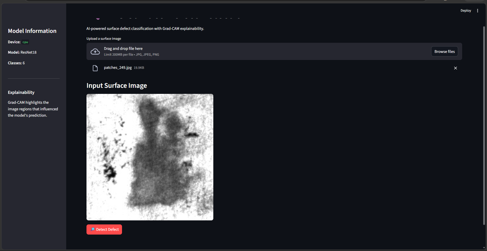
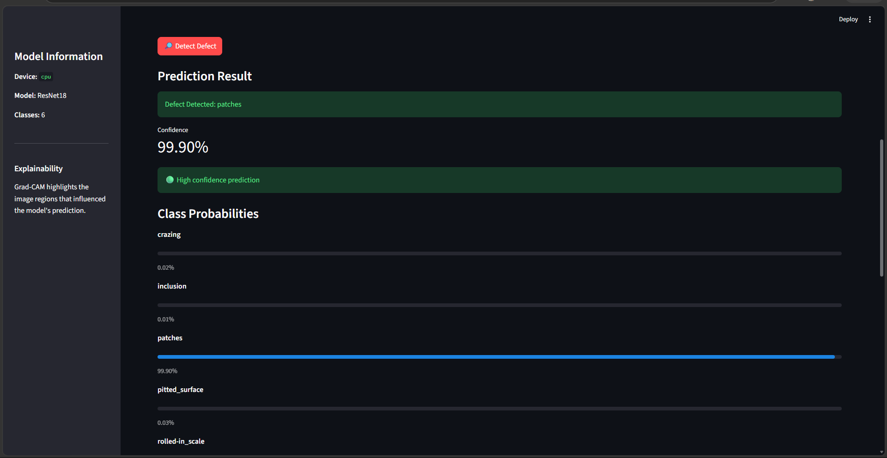
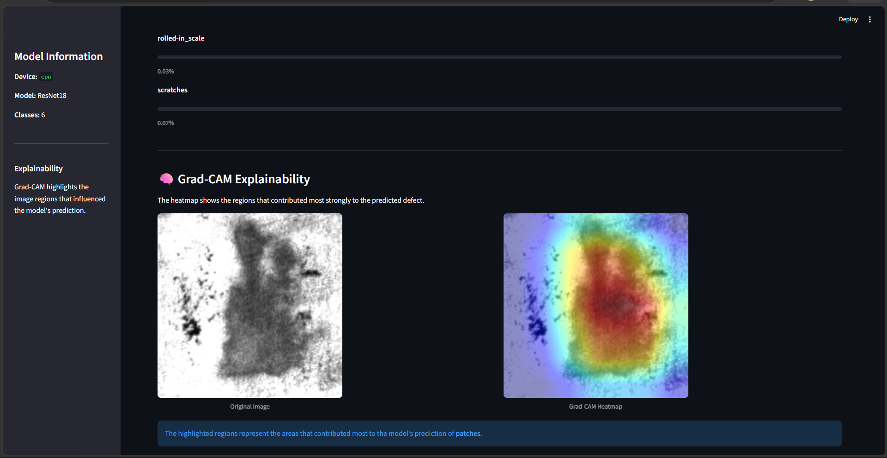
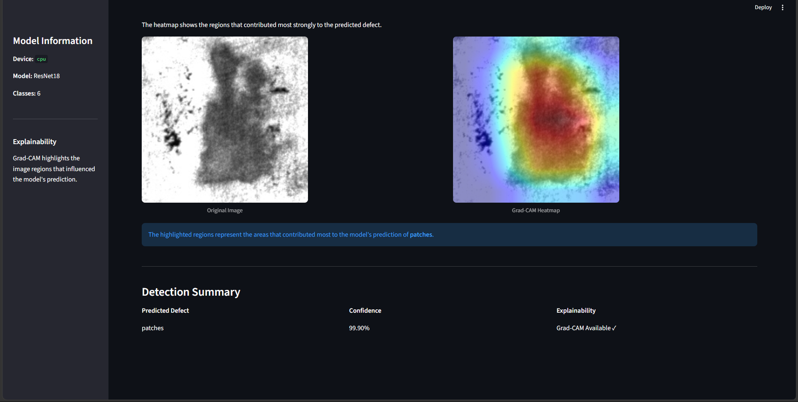
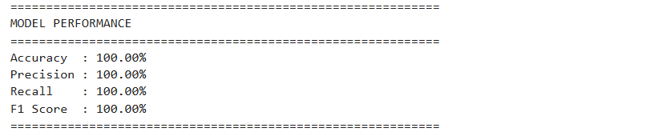
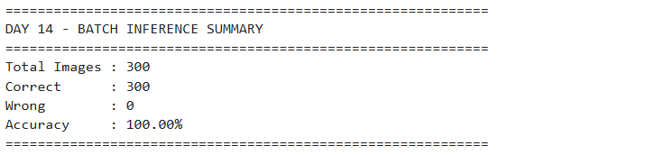

# NEU Surface Defect Detection & Explainable AI

An AI-based industrial surface defect classification system that uses Deep Learning and Explainable AI to identify and interpret surface defects in steel images.

## Overview

Industrial surface inspection is an important quality-control task in manufacturing. Manual inspection can be time-consuming and may produce inconsistent results.

This project develops an automated image classification system using a ResNet18 deep learning model trained on the NEU Surface Defect Database.

The system can:

- Classify steel surface defects into six categories
- Predict the defect class with confidence
- Provide class probability analysis
- Generate Grad-CAM visualizations for model explainability
- Perform single-image inference
- Perform batch inference on multiple images
- Analyze model performance
- Evaluate model robustness under noisy image conditions
- Provide a Streamlit-based web interface

---

## Defect Classes

The model classifies images into six surface defect categories:

1. Crazing
2. Inclusion
3. Patches
4. Pitted Surface
5. Rolled-in Scale
6. Scratches

---

## System Architecture

```text
                NEU Surface Defect Dataset
                         |
                         v
              Dataset Exploration
                         |
                         v
                Data Preprocessing
                         |
                         v
                  ResNet18 Model
                         |
                         v
                   Model Training
                         |
                         v
                 Model Evaluation
                         |
          +--------------+--------------+
          |                             |
          v                             v
    Image Inference              Grad-CAM Explainability
          |                             |
          v                             v
   Defect Prediction             Visual Explanation
          |
          v
     Performance Analysis
          |
          v
      Batch Inference
          |
          v
     Streamlit Web App
     ```
## Application Screenshots

### Streamlit Application


### Prediction Result


### Grad-CAM Explainability


### Detection Summary


### Model Performance


### Batch Inference
